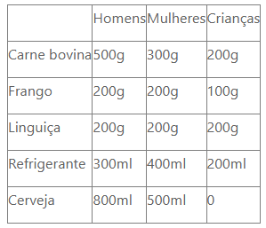

# Calculadora de quantidades para churrascos

Tem dúvidas sobre a quantidade de carne, calabresa, cerveja e outras coisas que vai precisar para seu churrasco? Com essa calculadora seus problemas se acabaram!

## Uso

1- Insira a quantidade de pessoas que frequentarão o churrasco. Precisa ter ao menos 1 adulto (homem ou mulher).

2- Clique em calcular.

3- As quantidades de carne bovina, frango, linguiça calabresa, cerveja e refrigerante aparecerão abaixo!

As quantidades seguem os pesos da tabela abaixo:

### Nota

Esta é a atividade MAPA (Material de Avaliação Prática de Aprendizagem) da disciplina Programação Front-End, para meu curso superior de tecnologia em Sistemas para Internet, na Unicesumar.